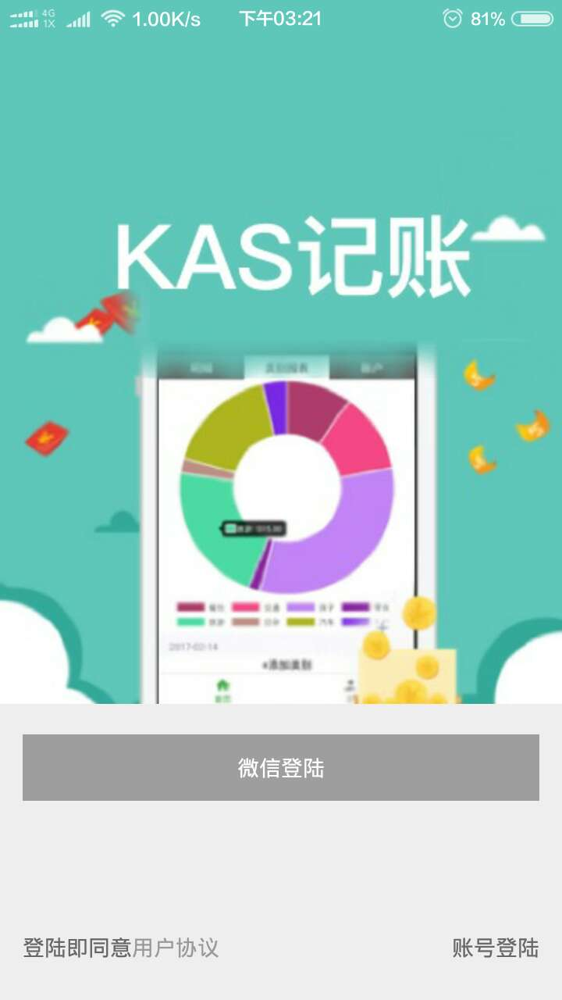
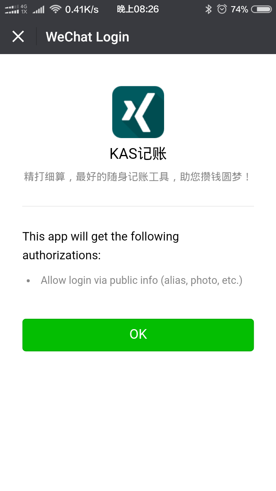
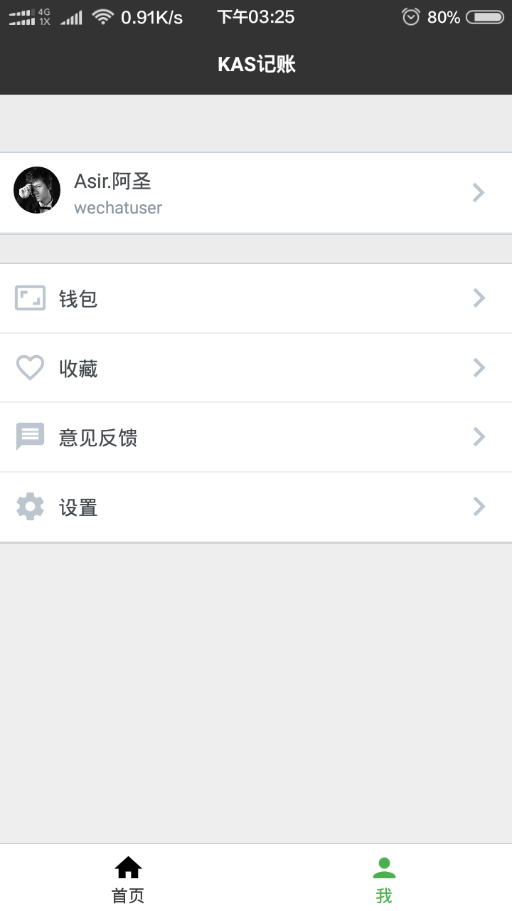
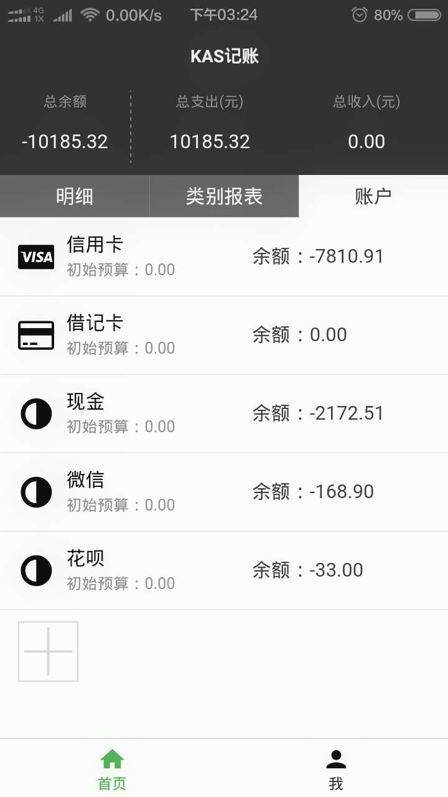
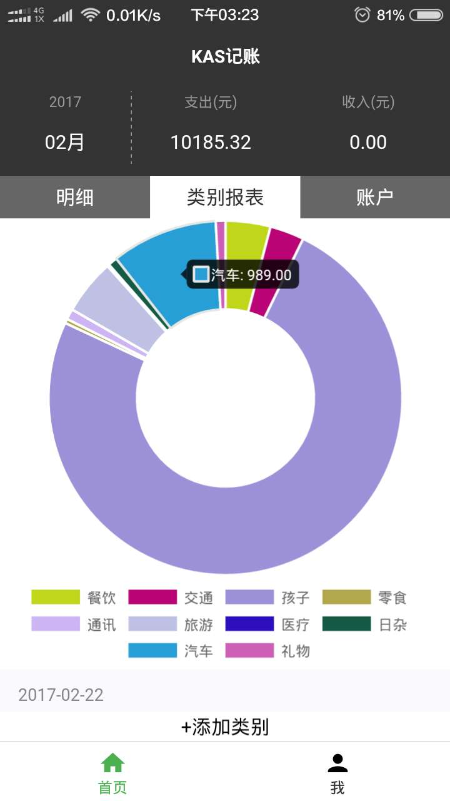
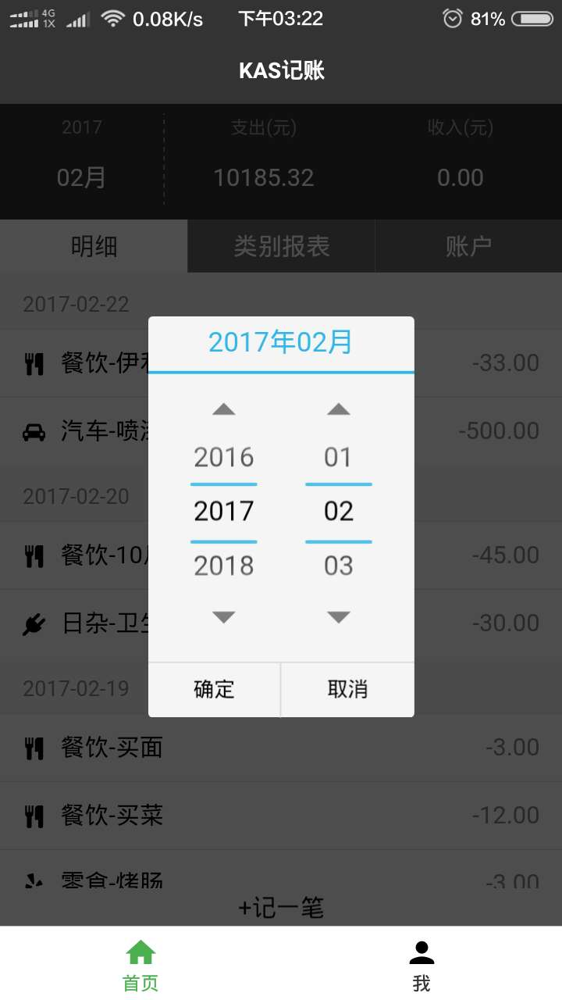

#JS全栈工程师之路-KeepAccounts
####WebApp客户端：使用 webpack + React + Redux + ES6 开发的组件化项目
####NativeApp客户端：React Native
####服务器端：Koa2.0 + MongoDB + Redis
####开发工具：Atom + Robomongo + Medis
##项目结构
KeepAccounts 
|-- kas-docs # 项目文档 
|-- [kas-koa2](https://github.com/Vizn/kas-koa2) # 服务器端 
|-- [kas-react-native-redux](https://github.com/Vizn/kas-react-native-redux) # app客户端 
|-- [kas-react-redux](https://github.com/Vizn/kas-react-redux) # webapp客户端 
|-- [kas-wechat](https://github.com/Vizn/kas-wechat) # 微信小程序 

##展示

